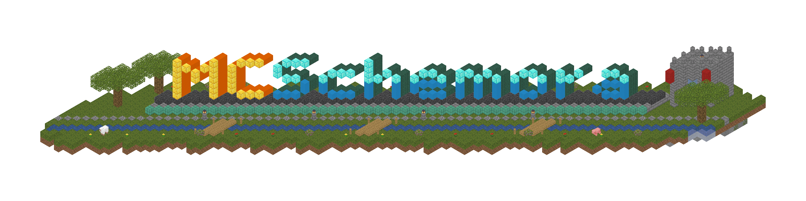
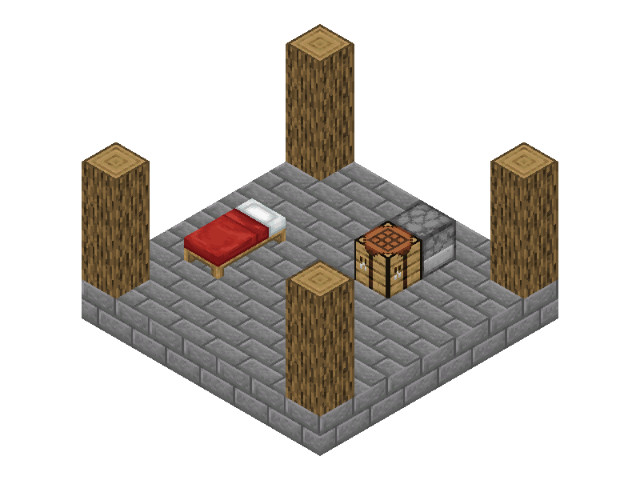
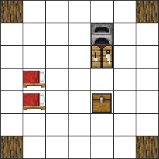

# MCSchemora

<p align="center">
  
</p>

Author, edit, convert, and render Minecraft schematics in Rust with Python and WASM bindings.
Supports `.schem`, `.litematic`, `.nbt`, `.snbt`, `.mcstructure`, and wiki blueprints.
Ready to go for agent-native authoring.

[Reproduce the banner build](examples/README.md#build-the-banner).

## Capabilities

- Build with version-checked block states, bulk edits, and named regions.
- Filter selections; copy, move, rotate, and mirror builds.
- Check Java game rules and inspect conversion losses before exporting.
- Render textured PNGs, GLB models, sprite diagrams, and layered wiki blueprints.

## Get started

### Python

With Python 3.10+, [uv](https://docs.astral.sh/uv/), and a stable
[Rust toolchain](https://rustup.rs/), run from this checkout:

```sh
uv sync --all-packages
uv run --all-packages python examples/build.py
uv run --all-packages python examples/render.py
```

Example schematic output:

<p align="center">
  
</p>

Example sprite output:

<p align="center">
  
</p>

### Rust

With a stable Rust toolchain, run from this checkout:

```sh
cargo run --example build
```

## Documentation

- [Quickstarts: Python](bindings/python/README.md) · [Rust](docs/guides/getting-started-rust.md) · [Browser WASM](bindings/wasm/README.md).
- [Usage guide](docs/guides/usage.md) · [Examples and output gallery](examples/README.md).
- [API reference](docs/reference/api.md) · [Catalogs and assets](docs/reference/minecraft-data.md).
- [Documentation index and maintenance](docs/index.md).

## License

Project code is [MIT licensed](LICENSE). Bundled and downloaded assets have
[their own attribution and terms](docs/reference/minecraft-data.md#asset-attribution).
