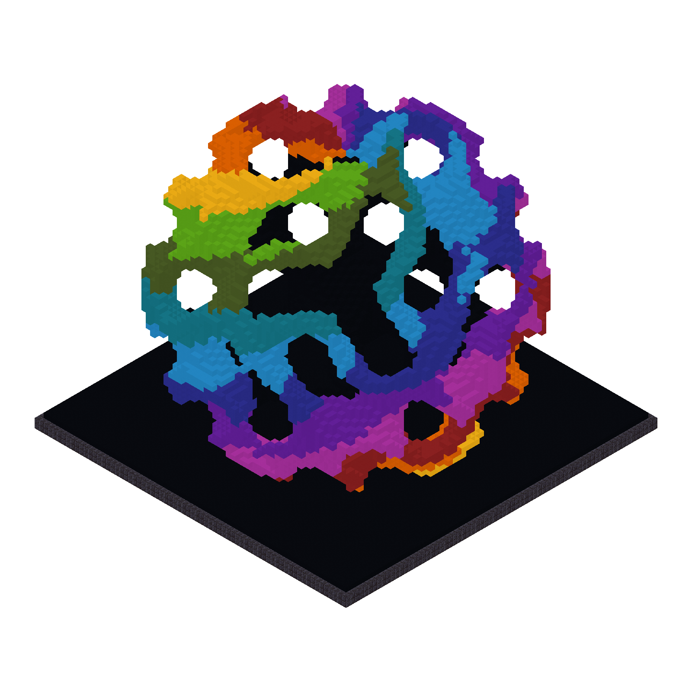
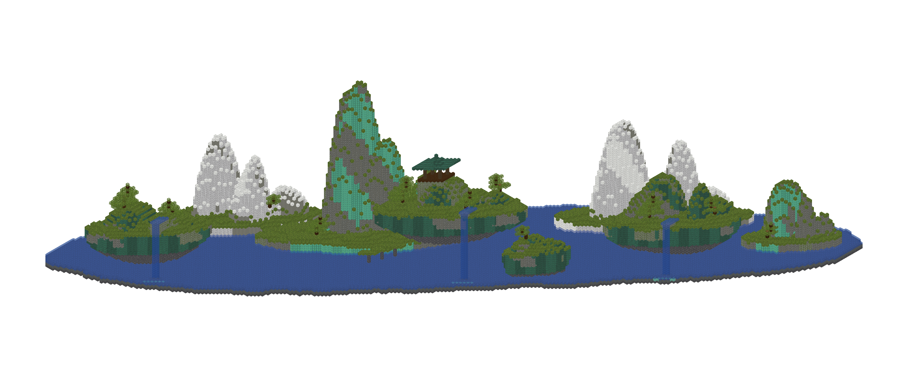

# Examples

Run from the repository root. Python examples need `uv sync --all-packages`;
the Rust example needs a stable Rust toolchain. Examples pin Java 1.21.1.
Catalogs download on first use; PNG/GLB also download visual assets.
Generated files go in the ignored `examples/output/` directory.

| Workflow | Script | Outputs |
| --- | --- | --- |
| Build and inspect | [build.py](build.py) | `workshop.schem`, a text layer, validation report |
| Build with Rust | [build.rs](build.rs) | `floor.schem`, validation report |
| Copy, rotate, restyle | [edit.py](edit.py) | `workshops.schem`, bounds and block count |
| Inspect and convert | [convert.py](convert.py) | Destination file and export report |
| Render and blueprint | [render.py](render.py) | Textured PNG, sprite PNG, GLB, `.wiki` template, visual diagnostics |
| Build the README banner | [banner.py](banner.py) | `banner.schem`, `banner.png` |
| Build procedural rainbow art | [reef.py](reef.py) | `reef.schem`, `reef.png` |
| Build a jade mountain scroll | [jade_scroll.py](jade_scroll.py) | `jade-scroll.schem`, `jade-scroll.png` |

## Build and inspect

```sh
uv run --all-packages python examples/build.py
```

The workshop has a stone-brick floor, four log pillars, a slab roof, a bed,
an inventory chest, a crafting table, and a furnace. Actual output:

```text
y=1; x=0..6, z=0..6
4 . . . . . 4
. . . . 3 . .
. . . . 2 . .
. 6 . . . . .
. 5 . . 1 . .
. . . . . . .
4 . . . . . 4
. = air; - = unselected
1 = minecraft:chest[facing=north,type=single,waterlogged=false]
2 = minecraft:crafting_table
3 = minecraft:furnace[facing=west,lit=false]
4 = minecraft:oak_log[axis=y]
5 = minecraft:red_bed[facing=north,occupied=false,part=foot]
6 = minecraft:red_bed[facing=north,occupied=false,part=head]
No issues found.
Saved workshop.schem
```

## Build with Rust

```sh
cargo run --example build
```

```text
Validation: Report { errors: [], warnings: [], unknown: [] }
Saved floor.schem
```

See [getting started with Rust](../docs/guides/getting-started-rust.md) for local
dependency setup and examples of loading and rendering.

## Build the banner

```sh
uv run --all-packages python examples/banner.py
```

<p align="center">
  
</p>

## Build the gyroid rainbow reef

```sh
uv run --all-packages python examples/reef.py
```


<p align="center">
  
</p>

## Build the jade mountain scroll

```sh
uv run --all-packages python examples/jade_scroll.py
```

<p align="center">
  
</p>

## Copy, rotate, and restyle

```sh
uv run --all-packages python examples/edit.py
```

```text
Original bounds: Bounds(start=(0, 0, 0), size=(7, 5, 7))
Copy bounds: Bounds(start=(10, 0, 0), size=(7, 5, 7))
Birch logs: 12
No issues found.
Saved workshops.schem
```

The copied workshop is rotated by a quarter turn, including its directional
block states, then its log pillars are replaced with birch logs.

## Convert

Run the build example first:

```sh
uv run --all-packages python examples/convert.py examples/output/workshop.schem examples/output/workshop.litematic
```

```text
Edition: java; version: 1.21.1
Regions: main
No issues found.
Saved workshop.litematic
```

Conversion exits before writing if the export report has errors or unaccepted
losses. `--flatten` combines nonoverlapping regions; `--allow-loss` explicitly
accepts reported omissions. See the [conversion workflow](../docs/guides/usage.md#inspect-and-convert).

## Render and export a blueprint

```sh
uv run --all-packages python examples/render.py
```

Textured cutaway, with the roof excluded from this preview:

<p align="center">
  
</p>

Sprite diagram of local/world Y=1:

<p align="center">
  
</p>

See [usage guide](../docs/guides/usage.md) for more details.
